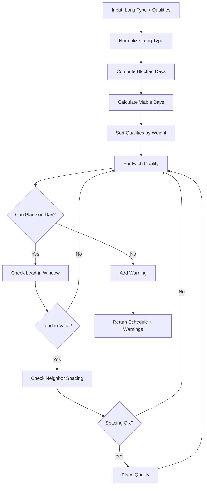

# RunScheduler Architecture

## System Design

### Core Algorithm: Deterministic Greedy Scheduler

The planner uses a deterministic greedy algorithm with bilateral neighbor validation to optimally place quality workouts throughout the week while respecting recovery constraints.

```
Input: Long run type, distance, quality selections
Output: Weekly schedule with placed qualities and warnings
```

### Algorithm Flow



## Data Flow

### 1. Input Processing
```typescript
PlanInput {
  longType: LongKey          // "easy" | "progressive" | "hilly" | "big" | "mp"
  longDistanceMi: number      // Distance for auto-upgrade
  qualitySelections: string[] // Keys from quality catalog
}
```

### 2. Long Run Processing
- **Auto-upgrade**: Easy → Big at ≥21 miles
- **Buffer calculation**: Days blocked before/after Sunday
- **Viable days**: Mon-Sat minus blocked days

### 3. Quality Scheduling

#### Sort Order (Deterministic)
1. **Primary**: Weight (descending) - heavier workouts first
2. **Secondary**: Selection index - preserves user's input order
3. **Tertiary**: Alphabetical key - final tiebreaker

#### Placement Validation
For each quality Q attempting placement on day D:

1. **Blocked Check**: D must not be in blocked set
2. **Occupied Check**: D must not have existing quality
3. **Lead-in Window**: Days [D-Q.before, D-1] must be quality-free
4. **Left Neighbor**: If exists at L, require (D - L - 1) ≥ max(after[L], before[Q])
5. **Right Neighbor**: If exists at R, require (R - D - 1) ≥ max(after[Q], before[R])

### 4. Output Generation
```typescript
PlanResult {
  viableDays: DayIndex[]     // Days available for qualities
  schedule: {[day]: quality}  // Placed workouts
  warnings: string[]          // Unplaceable sessions
}
```

## Component Architecture

### Frontend (Next.js)

```
web/
├── app/
│   ├── page.tsx            # Main app component
│   ├── layout.tsx          # Theme provider wrapper
│   └── globals.css         # Tailwind styles
├── components/
│   ├── LongRunConfig.tsx   # Long run configuration
│   ├── QualitySelector.tsx # Quality multi-select
│   ├── WeekGrid.tsx        # Visual calendar
│   ├── PlanSummary.tsx     # Stats and export
│   └── ThemeProvider.tsx   # Dark mode context
└── lib/
    └── planner-adapter.ts  # Bridge to core logic
```

### Backend (TypeScript Core)

```
src/
├── planner.ts              # Core algorithm
└── planner.test.ts         # Test suite
```

## State Management

### Client State (React)
- **Long run config**: Type and distance
- **Quality selections**: Array of selected keys
- **Plan result**: Schedule and warnings
- **UI state**: Theme, saved plans

### Persistent State (LocalStorage)
- **Theme preference**: light/dark mode
- **Saved plans**: Last 10 weekly plans with notes

## Key Design Decisions

### 1. Bilateral Neighbor Checking
**Problem**: Original greedy algorithm only checked last placed item
**Solution**: Check both nearest left AND right neighbors for spacing

### 2. Deterministic Ordering
**Problem**: Equal weights could produce different outputs
**Solution**: Three-tier stable sort (weight → index → key)

### 3. Lead-in vs Spacing
**Distinction**:
- Lead-in: Easy days immediately before a quality
- Spacing: Recovery days between two qualities

### 4. Blocked Days as Valid Lead-in
**Decision**: Days blocked by long run count as "easy" for lead-in purposes
**Rationale**: They are guaranteed quality-free

## Performance Characteristics

### Time Complexity
- **Overall**: O(Q × D) where Q = qualities, D = days (max 6)
- **Neighbor lookup**: O(1) with maintained schedule map
- **Sorting**: O(Q log Q) but Q typically ≤ 4

### Space Complexity
- **Schedule**: O(D) for day-to-quality mapping
- **Blocked set**: O(D) for blocked days
- **Warnings**: O(Q) worst case

## Testing Strategy

### Unit Tests
- Blocking patterns for each long type
- Lead-in validation edge cases
- Spacing enforcement scenarios
- Auto-upgrade logic
- Determinism verification

### Integration Tests
- Example weeks from specification
- Max load scenarios
- Empty/invalid inputs
- Unknown quality keys

### Coverage Metrics
- 25 tests covering all critical paths
- 100% of constraint types tested
- Edge cases for calendar boundaries

## Extensibility Points

### 1. Context Adjustments
```typescript
interface Context {
  heat?: boolean
  hilly?: boolean
  lifeStress?: "normal" | "high"
}
// Modify after values based on context
```

### 2. Custom Week Start
```typescript
interface Config {
  weekStartsOn?: DayIndex  // Default: 0 (Monday)
}
// Rotate day indices accordingly
```

### 3. Alternative Algorithms
- **Backtracking**: Maximize placed sessions
- **Constraint solver**: Global optimization
- **ML-based**: Learn from athlete history

## Security Considerations

### Input Validation
- Quality keys validated against catalog
- Distance bounds checked (10-26 miles)
- Array length limits for selections

### Output Sanitization
- HTML escaping in React components
- ICS file generation uses safe templates
- LocalStorage size limits enforced

## Deployment Considerations

### Development
```bash
npm run dev    # Local development
npm test       # Run test suite
```

### Production Build
```bash
npm run build  # TypeScript compilation
cd web && npm run build  # Next.js production build
```

### Environment Requirements
- Node.js 18+
- npm 8+
- Modern browser with ES2020 support

---

*Architecture designed for maintainability, testability, and extensibility*